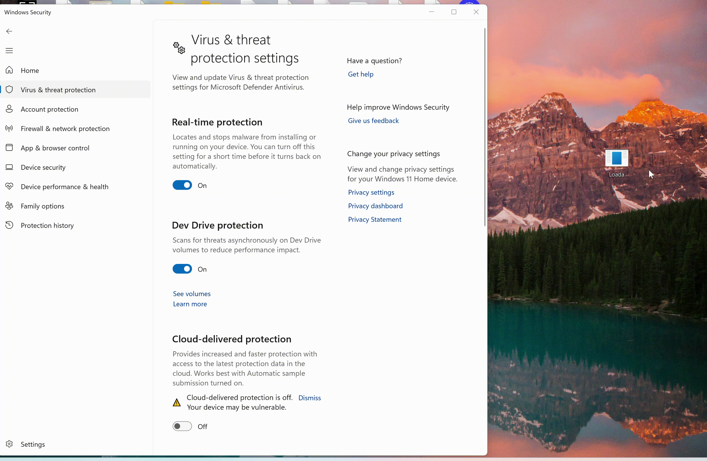

## SleepyLoader

This is a basic shellcode loader in C , the main features of this are API resolution by hash (no plaintext API names) , Custom GetProcAddressByHash implementation , Shellcode staging (classic allocate → copy → protect) , Execution via Thread Pool Wait callback (indirect execution) , cleanup



## Setup Instructions

```
x86_64-w64-mingw32-gcc -O2 -s -static -o loader.exe loader.c
```
Note:
- Compile as 64-bit. The hash values and pointer arithmetic assume a 64-bit process.
- The shellcode buffer (buff[]) must be filled with valid x64 shellcode before compiling.
